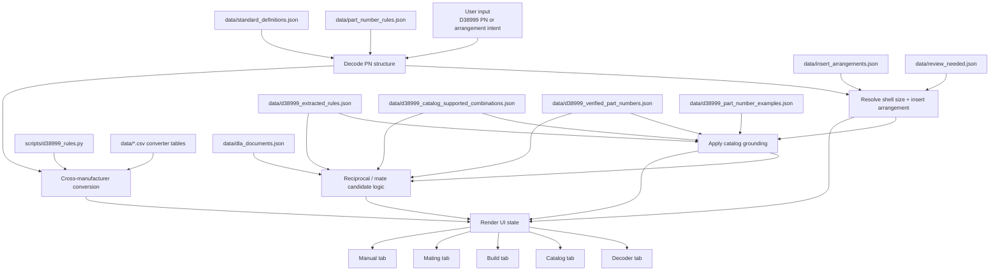

# D38999 Relation And Thinking Map

This document is a working map of how the repo fits together and how the rule system thinks.

It answers two different questions:

- `Relation map`: Which files produce, transform, bundle, and consume the D38999 data.
- `Thinking map`: Which rule layers the app uses when decoding, validating, converting, and finding mates.

## 1. Relation Map

```mermaid
flowchart TD
    PDFs[docs/pdfs/*.pdf\nDLA + manufacturer catalogs]
    Text[text/*.txt\nworking text extracts]
    Std[data/reference/std1560.pdf\nMIL-STD-1560]

    ExtractArr[scripts/extract_arrangements.py]
    ExtractStd[scripts/extract_standard_definitions.py]
    ExtractDla[scripts/extract_dla_documents.py]
    RulesPy[scripts/d38999_rules.py]
    BuildDb[scripts/build_d38999_database.py]
    BuildApp[scripts/build_app.py]
    ConvertCli[scripts/convert_d38999.py]

    ArrJson[data/insert_arrangements.json]
    PartRules[data/part_number_rules.json]
    StdDefs[data/standard_definitions.json]
    DlaDocs[data/dla_documents.json]
    Review[data/review_needed.json]

    ConvCsv[data/conversion_rules.csv]
    StyleCsv[data/style_mappings.csv]
    FinishCsv[data/finish_mappings.csv]
    ConstraintCsv[data/rule_constraints.csv]
    ExampleCsv[data/example_conversions.csv]

    ResearchRules[data/d38999_extracted_rules.json]
    ResearchCombos[data/d38999_catalog_supported_combinations.json]
    ResearchVerified[data/d38999_verified_part_numbers.json]
    ResearchExamples[data/d38999_part_number_examples.json]
    ResearchVisuals[data/d38999_visual_assets.json]

    AppData[app/app-data.js\nembedded data bundle]
    AppJs[app/app.js]
    ConvJs[app/converter.js]
    AppHtml[app/index.html]
    AppCss[app/styles.css]
    AppDataCopies[app/data/*.json]
    AppSvg[app/assets/svg/* + app/assets/d38999/svg/*]

    DocsReciprocal[docs/reciprocal_connector_logic.md]
    DocsBuild[docs/build_part_number_validation.md]
    DocsResearch[docs/d38999_pdf_research_report.md]
    DocsVisual[docs/d38999_visual_asset_notes.md]

    PDFs --> ExtractArr
    PDFs --> ExtractStd
    PDFs --> ExtractDla
    PDFs --> RulesPy
    Text --> RulesPy
    Std --> ExtractArr

    ExtractArr --> ArrJson
    ExtractArr --> Review
    ExtractStd --> PartRules
    ExtractStd --> StdDefs
    ExtractDla --> DlaDocs

    RulesPy --> BuildDb
    RulesPy --> ConvertCli
    RulesPy --> BuildApp
    BuildDb --> ConvCsv
    BuildDb --> StyleCsv
    BuildDb --> FinishCsv
    BuildDb --> ConstraintCsv
    BuildDb --> ExampleCsv

    ResearchRules --> BuildApp
    ResearchCombos --> BuildApp
    ResearchVerified --> BuildApp
    ResearchExamples --> BuildApp
    ResearchVisuals --> BuildApp
    ArrJson --> BuildApp
    PartRules --> BuildApp
    StdDefs --> BuildApp
    DlaDocs --> BuildApp
    Review --> BuildApp
    RulesPy --> AppData

    BuildApp --> AppData
    BuildApp --> AppDataCopies
    BuildApp --> AppSvg

    AppHtml --> AppJs
    AppHtml --> ConvJs
    AppHtml --> AppCss
    AppHtml --> AppData

    AppData --> AppJs
    AppData --> ConvJs
    AppDataCopies --> AppJs
    AppSvg --> AppJs

    DocsResearch --> ResearchRules
    DocsResearch --> ResearchCombos
    DocsResearch --> ResearchVerified
    DocsReciprocal --> ResearchRules
    DocsBuild --> ResearchRules
    DocsVisual --> ResearchVisuals
```

## 2. File Roles

### Source layer

- `docs/pdfs/` is the evidence layer: MIL base spec, DLA slash sheets, and manufacturer catalogs.
- `text/` is the searchable working layer used while extracting and normalizing rules.
- `data/reference/std1560.pdf` is the correction/reference source for insert arrangement labels.

### Extraction and normalization layer

- `scripts/extract_arrangements.py` turns drawing PDFs into `insert_arrangements.json` plus arrangement SVGs.
- `scripts/extract_standard_definitions.py` turns the spec into `part_number_rules.json` and `standard_definitions.json`.
- `scripts/extract_dla_documents.py` inventories DLA documents into `dla_documents.json`.
- `scripts/d38999_rules.py` is the hand-curated converter rule engine for cross-manufacturer mapping.

### Structured rule/data layer

- `data/insert_arrangements.json`: contact coordinates, counts, sizes, outlines, guide paths.
- `data/part_number_rules.json`: part-number grammar and field structure.
- `data/standard_definitions.json`: slash sheets, classes, contact styles, shell-size codes, polarization definitions.
- `data/dla_documents.json`: DLA document inventory and machine-readable sheet metadata.
- `data/review_needed.json`: extraction gaps and manual-review flags.
- `data/d38999_extracted_rules.json`: catalog-grounding policy, mating rules, normalized shell-style logic.
- `data/d38999_catalog_supported_combinations.json`: supported shell-style/contact/keying combinations.
- `data/d38999_verified_part_numbers.json`: exact part numbers seen verbatim in catalogs.
- `data/d38999_part_number_examples.json`: cited examples used for explanation and testing.
- `data/d38999_visual_assets.json`: visual asset inventory and safe recreation notes.

### Build/bundle layer

- `scripts/build_d38999_database.py` exports CSV tables from `scripts/d38999_rules.py` for converter/database workflows.
- `scripts/build_app.py` copies JSON/SVG assets into `app/` and embeds the runtime bundle in `app/app-data.js`.

### Runtime/UI layer

- `app/index.html` defines tab structure and host panels.
- `app/app.js` is the main pinout/decoder/mating/build/manual runtime.
- `app/converter.js` is the manufacturer conversion runtime.
- `app/styles.css` is the unified visual system.
- `app/app-data.js` is the browser runtime data payload.

## 3. Thinking Map

## 4. Rule Stack By Problem

### A. Decode a D38999 part number

Thinking order:

1. Confirm the PN matches the D38999 field order in `data/part_number_rules.json`.
2. Interpret slash sheet, class, shell-size code, contact style, and keying from `data/standard_definitions.json`.
3. Convert shell-size code plus insert number into an arrangement ID using `data/insert_arrangements.json`.
4. If arrangement data is incomplete or suspicious, check `data/review_needed.json`.

Use this when reading `app/app.js`:

- Syntax/field order comes from `partRules`.
- Meaning of each field comes from `defs`.
- Geometry and contact map come from `arrangements`.

### B. Validate whether the decoded or built part is trustworthy

Thinking order:

1. Check whether the shell style exists in `data/d38999_extracted_rules.json`.
2. Check whether shell style, contact style, and keying are supported in `data/d38999_catalog_supported_combinations.json`.
3. Check whether the exact PN exists in `data/d38999_verified_part_numbers.json`.
4. If exact PN is absent but the combination is rule-supported, downgrade to `VALID_FORMAT_BUT_NOT_CONFIRMED`.
5. If the combination conflicts, return `INVALID_COMBINATION`.
6. If evidence is missing, return `MISSING_DATA` or `MANUFACTURER_SPECIFIC_UNCERTAIN`.

This is the core trust model for build and mating logic.

### C. Find a reciprocal / mating connector

Thinking order:

1. Start from a normalized decoded object, not from string mutation.
2. Hold constant: series/interface, shell size, insert arrangement, keying.
3. Flip: plug vs receptacle role and pin vs socket contact gender.
4. Ask `data/d38999_extracted_rules.json` for allowed mating slash sheets.
5. Ask `data/d38999_catalog_supported_combinations.json` whether the target combination is allowed.
6. Ask `data/d38999_verified_part_numbers.json` whether the exact target PN has been seen.
7. Rank candidates by hard-rule compliance first, verification strength second.

### D. Convert between D38999 and manufacturer families

Thinking order:

1. Parse the D38999 side into normalized fields.
2. Use `scripts/d38999_rules.py` as the authoritative converter rule source.
3. Use the CSV exports for table/debug/database views, but treat the Python rules as the owning logic.
4. Normalize manufacturer shell style, finish, shell size, insert, contact style, and keying back to D38999 concepts.

## 5. Owning Abstractions

When changing behavior, start from the owning layer instead of the UI symptom.

| Question | Owning file or layer |
| --- | --- |
| What does a slash sheet or class code mean? | `data/standard_definitions.json` |
| How is the PN field order defined? | `data/part_number_rules.json` |
| Where do contact coordinates and counts come from? | `data/insert_arrangements.json` |
| Why is a decoded/built PN marked verified vs unconfirmed? | `data/d38999_extracted_rules.json` + `data/d38999_catalog_supported_combinations.json` + `data/d38999_verified_part_numbers.json` |
| Why did the mating finder allow or reject a candidate? | `data/d38999_extracted_rules.json` and `docs/reciprocal_connector_logic.md` |
| Where do converter mappings originate? | `scripts/d38999_rules.py` |
| How do JSON and SVG assets get into the runnable app? | `scripts/build_app.py` |
| Which browser runtime consumes the bundled data? | `app/app.js` and `app/converter.js` |

## 6. Practical Debug Route

If a future change breaks something, this is the shortest reasoning path.

### Decoder wrong

1. Check `data/part_number_rules.json`.
2. Check `data/standard_definitions.json`.
3. Check `app/app.js` decode logic.

### Arrangement or drawing wrong

1. Check `data/insert_arrangements.json`.
2. Check `data/review_needed.json`.
3. Check `scripts/extract_arrangements.py`.

### Build validation wrong

1. Check `data/d38999_extracted_rules.json`.
2. Check `data/d38999_catalog_supported_combinations.json`.
3. Check `data/d38999_verified_part_numbers.json`.
4. Then check `app/app.js` validation helpers.

### Mating candidate wrong

1. Check `docs/reciprocal_connector_logic.md` for intended behavior.
2. Check `data/d38999_extracted_rules.json` for allowed mate-sheet logic.
3. Check `data/d38999_catalog_supported_combinations.json` and exact verified PN data.
4. Then check the mating scoring/render path in `app/app.js`.

### Converter wrong

1. Check `scripts/d38999_rules.py` first.
2. Then check generated CSV exports if the issue is table-specific.
3. Then check `app/converter.js` or `scripts/convert_d38999.py`.

## 7. Short Summary

The repo has three main brains:

- `spec/extraction brain`: `data/part_number_rules.json`, `data/standard_definitions.json`, `data/insert_arrangements.json`
- `catalog-grounding brain`: `data/d38999_extracted_rules.json`, `data/d38999_catalog_supported_combinations.json`, `data/d38999_verified_part_numbers.json`
- `conversion brain`: `scripts/d38999_rules.py` plus exported CSVs

The app works by bundling all three into `app/app-data.js`, then `app/app.js` and `app/converter.js` turn that data into decode, catalog, build, mating, and manual behavior.