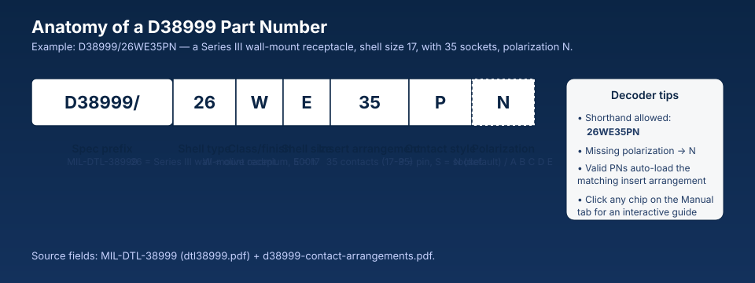
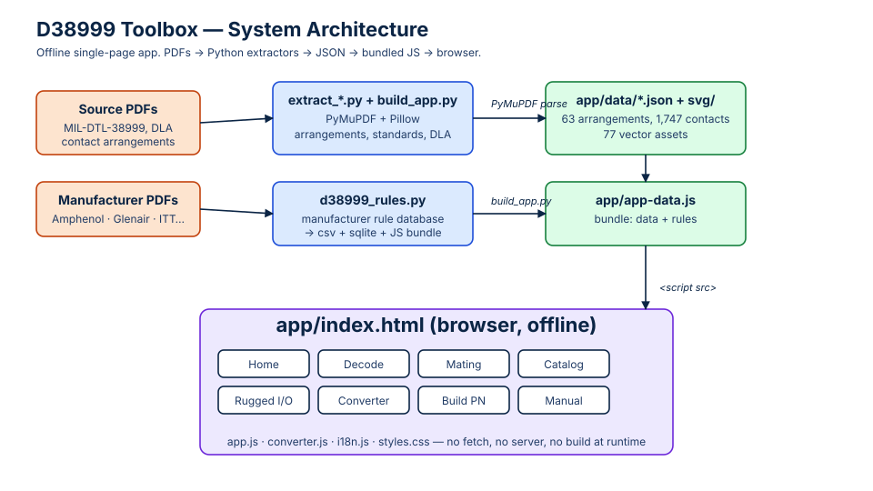
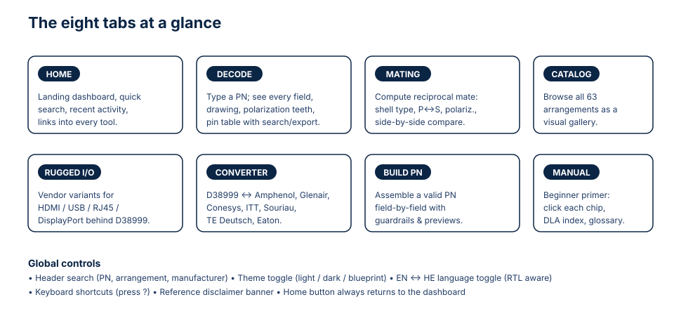
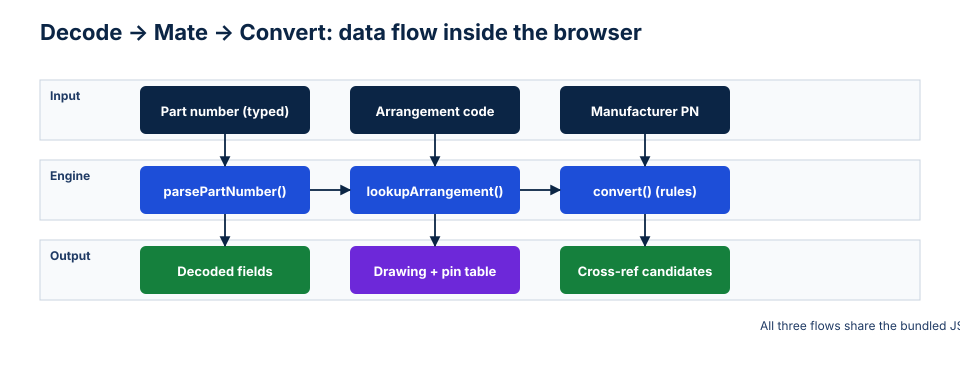
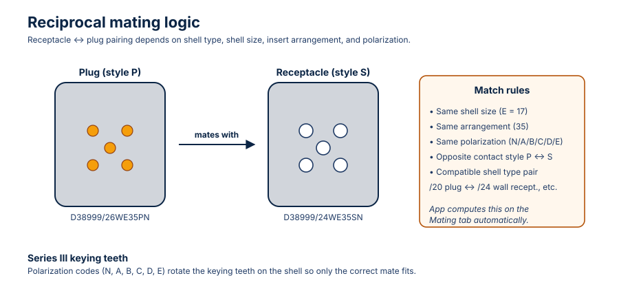

# D38999 Toolbox — App Description

> **Purpose of this document.** Feed this file (together with `02_user_manual.md` and the SVGs under `diagrams/`) into NotebookLM to generate slides, an audio overview / podcast, or a video walkthrough of the D38999 Toolbox.

---

## 1. Elevator pitch

The **D38999 Toolbox** is a self-contained, offline single-page web app that turns the dense world of **MIL-DTL-38999 / D38999 circular connectors** into something a hardware engineer, harness designer, technician, or student can actually use. It runs in any browser straight from `app/index.html` — no server, no build, no internet, no install.

In one place it lets you:

- **Decode** any D38999 part number, including shorthand like `26WE35PN`.
- **See** the connector face with the right insert arrangement, gauge-specific pin symbols, and Series III keying teeth.
- **Find the mate** of any connector (plug ↔ receptacle, P ↔ S, polarization rules).
- **Browse** all 63 insert arrangements and 1,747 documented contacts visually.
- **Convert** D38999 part numbers to **Amphenol, Conesys, Glenair, ITT Cannon, Souriau, TE Deutsch, and Eaton** equivalents — and back.
- **Build** a valid D38999 part number from scratch, field by field.
- **Learn** the standard via a beginner-friendly interactive manual.
- **Explore rugged I/O** variants (HDMI, USB, USB-C, RJ45, DisplayPort) packaged in D38999 shells.

Everything works on a single laptop in a SCIF, a clean room, an aircraft hangar, or a coffee shop with no Wi-Fi.

---

## 2. Who it is for

| Audience | What they get out of it |
|---|---|
| **Hardware / electrical engineers** | Quickly decode a PN on a drawing, find its mate, pick a manufacturer equivalent. |
| **Harness / wiring designers** | Look up the exact arrangement, gauge per contact, and pin labels for pinout schedules. |
| **Procurement / supply chain** | Cross-reference an obsolete or single-source PN against six other manufacturers in seconds. |
| **Field service technicians** | Identify the connector in front of them and find a mating spare. |
| **Students / new engineers** | Use the interactive Manual to learn what every character of a D38999 PN means. |
| **Trainers and course authors** | Use the visual catalog and Manual as a teaching aid. |

---

## 3. The problem it solves

MIL-DTL-38999 part numbers look like `D38999/26WE35PN`. Each character matters:

- `26` is a **shell type** (Series III wall-mount receptacle).
- `W` is a **class/finish** (olive cadmium, 500-hour salt-spray).
- `E` is a **shell size code** that maps to a real shell size (17).
- `35` is the **insert arrangement** (which has its own pin layout, gauges, and contact count).
- `P` is the **contact style** (pins; `S` = sockets).
- `N` is the **polarization** key (defaults to `N`; `A`–`E` rotate the keying teeth).

Engineers normally piece this together from a 600-page DLA detail spec, a separate arrangements PDF, and a stack of manufacturer catalogs that all use slightly different naming. The Toolbox bakes those PDFs into one searchable, drawable, exportable tool — and adds reciprocal-mating logic on top.

---

## 4. What is inside (high level)

- **Source PDFs** under `docs/pdfs/` — MIL-DTL-38999, the DLA contact-arrangements PDF, DLA shell-type slash sheets, MIL-STD-1560, and manufacturer catalogs.
- **Python extractors** under `scripts/` use PyMuPDF + Pillow to parse those PDFs into structured JSON and SVG crops.
- **Rule database** in `scripts/d38999_rules.py` encodes manufacturer cross-reference logic and exports `data/*.csv` plus a SQLite copy for analytics.
- **Generated app data** lives in `app/data/*.json` and `app/assets/svg/` (63 arrangement crops + 14+ custom illustrations).
- **The app itself** is just `app/index.html`, `styles.css`, `app.js`, `converter.js`, `i18n.js`, and the bundled `app-data.js`. It uses **no `fetch`**, no framework, no build pipeline at runtime.

That means the same folder works:

- Opened locally with `xdg-open app/index.html`.
- Served from **GitHub Pages** via the `.github/workflows/pages.yml` workflow.
- Dropped onto an isolated network share.

---

## 5. The eight tabs

| Tab | What it does |
|---|---|
| **Home** | Landing dashboard with global search, recent items, and links into every tool. |
| **Decode** | The flagship. Type a PN, get every field decoded, the connector drawing, polarization teeth, gauge-specific pin symbols, hoverable labels, search, CSV export, and side-by-side compare. |
| **Mating** | Computes the reciprocal connector for any decoded PN (shell-type pair, P ↔ S, matching polarization). |
| **Catalog** | A visual grid of all 63 insert arrangements you can click through. |
| **Rugged I/O** | Vendor variants for HDMI, USB, USB-C, RJ45, DisplayPort packaged inside D38999 shells, with manufacturer illustrations. |
| **Converter** | Bi-directional cross-reference: D38999 ↔ Amphenol, Conesys, Glenair, ITT Cannon, Souriau, TE Deutsch, Eaton. |
| **Build PN** | Assemble a valid D38999 PN field by field with guardrails and live preview. |
| **Manual** | Beginner primer: interactive PN chips, shell-type explainer, contact-style/finish summaries, DLA document index. |

Global controls (always available in the header): **search**, **theme toggle** (light / dark / blueprint / blueprint-dark), **EN ↔ HE language switch** (with full RTL layout), **keyboard shortcuts overlay** (press `?`), **Home** button, and a permanent **reference-only disclaimer** banner.

---

## 6. How decoding works under the hood

1. The browser loads `app-data.js` — a single JS bundle containing every JSON dataset and the converter rules.
2. `parsePartNumber()` in `app.js` splits the PN into fields per MIL-DTL-38999.
3. `lookupArrangement()` joins the insert-arrangement code (and shell size) against `insert_arrangements.json` to get pin coordinates, labels, and gauges.
4. The connector face is rendered as **SVG**, with hover handlers added per contact.
5. For **mating**, the toolbox applies the reciprocal rules captured in `docs/reciprocal_connector_logic.md` (shell-type pair table, P ↔ S, same arrangement, same polarization).
6. For **conversion**, `converter.js` walks the manufacturer rule database and returns candidate PNs per vendor.

All of this happens client-side, synchronously, with no network call.

---

## 7. Reciprocal mating in one picture

A plug only mates with a receptacle when:

- Shell sizes match (`E` ↔ `E`).
- Insert arrangements match (`35` ↔ `35`).
- Polarization keys match (`N` ↔ `N`, or `A` ↔ `A`, etc.).
- Contact styles are opposite (`P` ↔ `S`).
- Shell types are a compatible pair (for example a `/26` wall-mount receptacle pairs with a `/24` plug per the DLA shell-type tables).

The Mating tab presents this as a single result card so you do not have to hold the rules in your head.

---

## 8. Data provenance and honesty

The Toolbox is deliberately conservative about what it claims to know:

- Every decoded field traces back to a source PDF or to `scripts/d38999_rules.py`.
- Any field that cannot be found in the source data is rendered as **unknown / needs manual verification** instead of being silently guessed.
- A permanent banner reminds the user: *"Reference only. Always cross-check against manufacturer datasheets and apply engineering judgment before specifying or installing any connector."*

This is why the app is appropriate for engineering reference but never sold as a single source of truth.

---

## 9. Why it matters

1. **Offline-first.** Works on isolated networks, classified facilities, and aircraft.
2. **No vendor lock-in.** Equally fair to all seven manufacturers; the cross-reference is symmetric.
3. **Self-documenting.** The Manual tab teaches users the standard while they use the tool.
4. **Auditable.** Every dataset is generated from a public PDF by a script in the repo. You can re-run the extractors and diff the output.
5. **Tiny footprint.** A few MB of HTML/CSS/JS/SVG, deployable to GitHub Pages with one workflow.

---

## 10. Suggested NotebookLM outputs

When you load this folder into NotebookLM, useful prompts are:

- *"Create a 6-minute audio overview aimed at a hardware engineer who has never used the D38999 Toolbox."*
- *"Generate a 12-slide deck that introduces the app, walks through the eight tabs, and ends with the data-provenance story."*
- *"Make a short explainer video script that decodes the part number `D38999/26WE35PN` step by step, using the part-number anatomy diagram."*
- *"Produce a beginner-friendly FAQ covering: what is D38999, what does each PN field mean, how do I find a mate, how do I convert to Amphenol?"*
- *"Draft a 2-minute podcast cold-open that hooks the listener with the pain of decoding military connector PNs by hand."*
