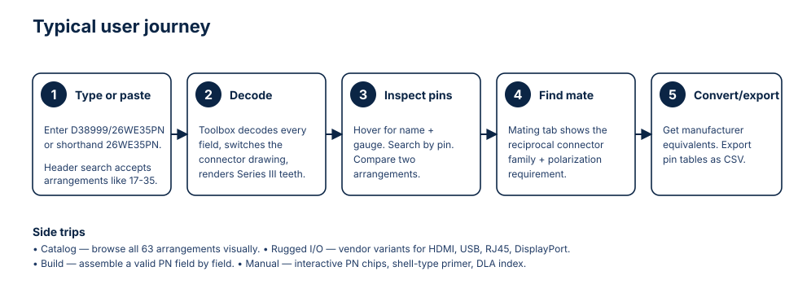

# D38999 Toolbox — User Manual

> Companion to `01_app_description.md`. This document walks a first-time user through every tab and feature. It is written to be ingested by NotebookLM alongside the SVGs in `diagrams/`, but it also reads cleanly as a standalone manual.



---

## 1. Getting started

### 1.1 Open the app

The D38999 Toolbox is a single HTML file. Just open it:

```bash
# Linux
xdg-open app/index.html

# macOS
open app/index.html

# Windows
start app\index.html
```

You can also browse to the hosted GitHub Pages URL if your fork has Pages enabled (`https://<your-user>.github.io/d38999_toolbox/`).

No installation, no server, no build step.

### 1.2 The header

Across the top you will find:

- **App title and tagline.**
- **Global search** — accepts a D38999 part number (e.g. `D38999/26WE35PN`), shorthand (`26WE35PN`), an arrangement code (`17-35`), or a manufacturer PN (e.g. `TV06RW-15-35PN`).
- **Keyboard shortcuts** button (or press `?`).
- **Theme toggle** — cycles light / dark / blueprint variants.
- **Language toggle** — switches between English and Hebrew (Hebrew flips the layout to right-to-left).
- **Home** button — always returns you to the dashboard.
- **Status pills** — show whether data loaded and which arrangement is currently selected.
- A permanent **"Reference only"** disclaimer banner above the header.

### 1.3 The eight tabs


From left to right: **Home · Decode · Mating · Catalog · Rugged I/O · Converter · Build PN · Manual**. Tabs are also reachable from quick links on the Home dashboard.

---

## 2. The Home tab

Use Home as your launchpad:

- **Quick search bar** mirrors the header search.
- **Recently used arrangements / PNs** so you can jump back to where you were.
- **Cards** that link to each major feature with one click.
- A condensed **"What is D38999?"** primer for first-time visitors who want a 30-second intro before diving in.

---

## 3. The Decode tab — the flagship


### 3.1 Type a part number

The PN input is pre-filled with `D38999/` to remind you of the canonical format. You can:

- Type the full PN: `D38999/26WE35PN`.
- Or use shorthand: `26WE35PN` — the decoder accepts it.
- Omit the polarization (`26WE35P`) and it will default to `N`.

As soon as the PN is valid, the tool:

1. Splits it into seven fields (spec prefix, shell type, class/finish, shell size, insert arrangement, contact style, polarization).
2. Looks up the correct **insert arrangement** and swaps the connector drawing.
3. Renders **Series III keying teeth** at the correct angle based on polarization (`N`, `A`, `B`, `C`, `D`, `E`).
4. Populates the **pin table** with each contact's label and gauge.

### 3.2 The connector drawing

The drawing is a real, scalable SVG generated from the official DLA arrangement PDFs:

- **Pin symbols** differ by gauge (size 22D, 20, 16, 12, 8, 4, etc.) so you can see at a glance which contacts are power vs. signal.
- **Hover** a contact to get a floating label with its name and gauge — nothing else, so the drawing stays readable.
- **Click** a contact to select it; the right-hand panel shows the full pin detail.
- **Series III teeth** are drawn from the Figure 6 angle table for the chosen polarization.

### 3.3 Pin table tools

- **Search** by pin label to jump straight to a specific contact.
- **Sort** by label, gauge, or position.
- **Export CSV** for use in a harness schedule or BOM.
- **Compare** two arrangements side by side using the compare panel.

### 3.4 Tips

- The selected arrangement is preserved when you switch tabs — go to **Mating** to see its mate without retyping.
- If a PN field is unrecognized, the decoder marks it as *unknown* rather than guessing.

---

## 4. The Mating tab


Open Mating after decoding a PN (or paste a PN directly). The tab:

- Shows your **current connector** with its decoded fields.
- Computes the **reciprocal connector** by applying the rules in `docs/reciprocal_connector_logic.md`:
  - Same shell size.
  - Same insert arrangement.
  - Same polarization key.
  - Opposite contact style (`P` ↔ `S`).
  - A compatible shell-type pair from the DLA table (for example `/26` wall-mount receptacle mates with `/24` straight plug).
- Renders **both connectors side by side** so you can visually confirm the mate.
- Lists candidate **manufacturer PNs** for the mate, drawn from the converter rules.

This is the fastest way to answer: *"My drawing calls out connector X — what do I order to plug into it?"*

---

## 5. The Catalog tab

A visual grid of all **63 insert arrangements** with:

- Thumbnail SVG of each insert.
- Contact count and gauge mix.
- A "view" link that loads the arrangement into the Decode tab.

Use it when you do not have a PN yet and just want to find an arrangement that fits your pin count and gauge needs.

---

## 6. The Rugged I/O tab

D38999 shells are increasingly used as ruggedized housings around standard data interfaces. This tab catalogs the most common variants:

- **HDMI** (e.g. Glenair SuperNine HDMI)
- **USB and USB-C**
- **RJ45 Ethernet**
- **DisplayPort / Mini DisplayPort**

Each entry shows the manufacturer SVG illustrations, the underlying D38999 shell, and notes on use.

---

## 7. The Converter tab


This is the cross-reference engine.

### 7.0 Smart input on the Decode tab (also accepts manufacturer P/Ns)

You do not have to come to the Converter tab first. The **Decode** tab now also accepts manufacturer part numbers. Type any of:

- `TV06RW-15-35PN` (Amphenol Tri-Start)
- `AE326WD35PN` (Conesys)
- `233-105-G6NF15-35PN` (Glenair)
- `KJA6T15W35PN` (ITT Cannon)
- `8D5-15W35PN` (Souriau)
- `DTS26W1535PN` (TE Deutsch)
- `BL...`, `ACT...` (Eaton, TE ACT)

…and a banner appears under the input:

> **Looks like a manufacturer P/N.** Decode as `D38999/26WE35PN`? *(Amphenol)* `[ Use D38999/26WE35PN ]` `[ Dismiss ]`

Click the suggestion and the app decodes the equivalent D38999 PN and renders the connector drawing as usual. If the input matches multiple manufacturer rules, the banner lists the top candidates so you can pick.

### 7.1 Print / Save as PDF (cross-reference + mate report)

After any successful decode (D38999 or via the smart-input bridge), the action row offers a single, casual-friendly export:

> **`🖨  Print / Save as PDF (cross-ref + mate)  [ N mate options ]`**

A **count badge** tells you up-front how many mate options will be included.

Clicking it opens a printable report in a new tab and surfaces a **Print / Save as PDF** button at the top right. From there, your browser's standard print dialog lets you save it as PDF or send it to a printer.

The report contains, per-section:

1. The **source connector** — connector body drawing + insert-arrangement face drawing, the D38999 PN, equivalents from all 7 supported manufacturers, shell-type label, mounting style (cable / wall / jam-nut / panel / square-flange / accessory), mating role (plug / receptacle / accessory), and a one-line summary.
2. **Every mate option** found by the reciprocal-mating engine — each as its own block with its own connector drawing and the same 8-row vendor cross-reference.
3. The **reference-only disclaimer**, source PN, and generation timestamp.

There is intentionally only one export format: a single PDF / print is enough for a casual user. No CSV, no JSON, no extra clicks.

### 7.2 D38999 → manufacturer (Converter tab)

1. Paste a D38999 PN.
2. The converter decodes the PN and looks up candidate equivalents from each manufacturer in the rule database.
3. Results are listed per vendor, e.g.:

| Manufacturer | Candidate PN |
|---|---|
| Amphenol | TV06RW-15-35PN |
| Conesys | AE326WD35PN |
| Glenair | 233-105-G6NF15-35PN |
| ITT Cannon | KJA6T15W35PN |
| Souriau | 8D5-15W35PN |
| TE Deutsch | DTS26W1535PN |

### 7.3 Manufacturer → D38999

Paste a manufacturer PN and the converter walks the rules in reverse, returning the matching D38999 PN (or several candidates if the manufacturer line maps to more than one shell type).

### 7.4 Tips

- Decoded fields (shell type, shell size, class/finish, insert arrangement, contact style, polarization) are always shown next to the results, so you can audit the conversion.
- A CLI version exists: `python scripts/convert_d38999.py D38999/26WD35PN`.

---

## 8. The Build PN tab

For when you want to construct a PN from scratch:

1. Pick the **shell type** from a dropdown (Series I wall-mount, Series III straight plug, etc.).
2. Pick the **class / finish** (W, F, J, M, …).
3. Pick the **shell size** (the picker shows both the letter code and the actual size).
4. Pick the **insert arrangement** (only arrangements compatible with the chosen shell size are offered).
5. Pick the **contact style** (`P` = pin, `S` = socket).
6. Pick the **polarization** (defaults to `N`).

A live preview at the top shows the assembled PN. If any combination is invalid (for example an arrangement that does not exist in the chosen shell size), the picker will block you and explain why.

---

## 9. The Manual tab

The Manual is the gentlest entry point. It contains:

- An **interactive PN guide** where every character (`D38999/`, `26`, `W`, `E`, `35`, `P`, `N`) is a clickable chip that opens a short explainer.
- A **shell-type primer** with the difference between `/20`, `/24`, `/26`, etc., in plain English.
- A separate explanation of **shell size vs shell-size code** (for example `E` = 17).
- Contact-style and finish reference tables.
- A **DLA document index** so you can see which Series III/IV shell-type slash sheets are approved vs. still in draft.

This tab is also the recommended starting point for trainers and students.

---

## 10. Search and navigation tips

- Press `?` for the keyboard shortcuts overlay.
- The header **search** is global: it routes you to the right tab automatically based on what you typed (PN → Decode, arrangement code → Catalog, manufacturer PN → Converter).
- The **theme toggle** is helpful when reading the drawings — the blueprint theme makes pin symbols pop.
- The **language toggle** flips the entire layout to right-to-left for Hebrew.

---

## 11. Exporting and sharing

- **CSV export** is available from the pin table (Decode tab).
- The app has no backend, so "sharing" is as simple as sharing the URL plus the PN you typed, or screenshotting the drawing.
- Because all assets are SVG, you can save a connector drawing from your browser and drop it into a Word doc or slide without losing resolution.

---

## 12. Troubleshooting

| Symptom | Likely cause | Fix |
|---|---|---|
| `Loading data` never disappears | `app-data.js` was not regenerated after editing JSON | Run `python scripts/build_app.py` |
| Connector drawing is blank | The arrangement code in the PN is not in the dataset | Use the Catalog tab to pick a known arrangement |
| Converter returns no candidates | The PN uses a shell type with no manufacturer rules yet | Check `scripts/d38999_rules.py` and add rules |
| Hebrew layout is broken | Browser cache served stale CSS | Hard refresh; the i18n direction is set before first paint |
| Tab keyboard shortcuts not working | Focus is inside an input | Click outside the input or press Esc |

---

## 13. Limitations and the reference-only disclaimer

The Toolbox is an engineering aid, not an authoritative source. Specifically:

- Some manufacturer rules are heuristic and may produce more than one candidate; verify against the vendor catalog.
- DLA slash sheets that are still in draft are flagged but not authoritative.
- Insert arrangements are taken from the DLA PDF; any typographical errors in the source carry through unless caught by the validation script.

Always cross-check against manufacturer datasheets before specifying or installing any connector.

---

## 14. Where to go next

- Read `01_app_description.md` for the higher-level "what and why".
- Open `app/index.html` and follow the journey diagram at the top of this file.
- For developers: `README.md` at the repo root documents how to regenerate the data with `scripts/extract_*.py` and `scripts/build_app.py`, and how the GitHub Pages workflow deploys the app.
