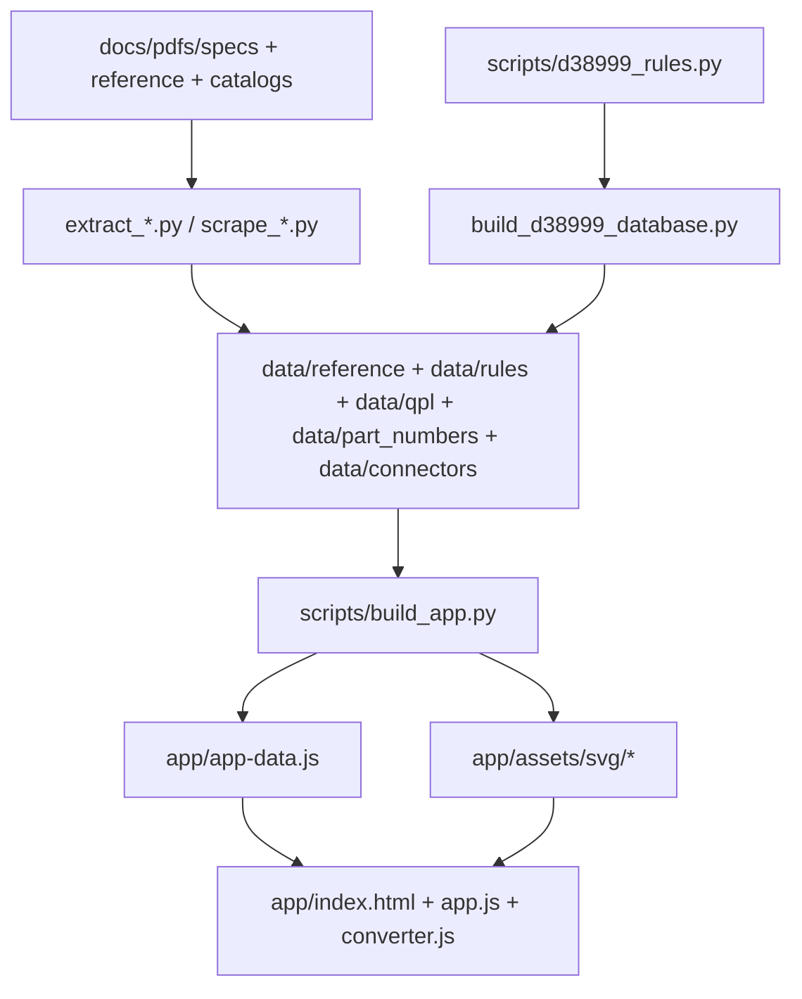
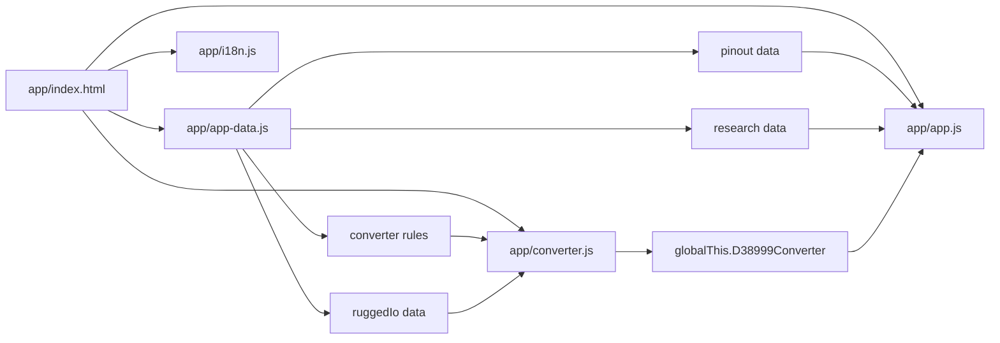
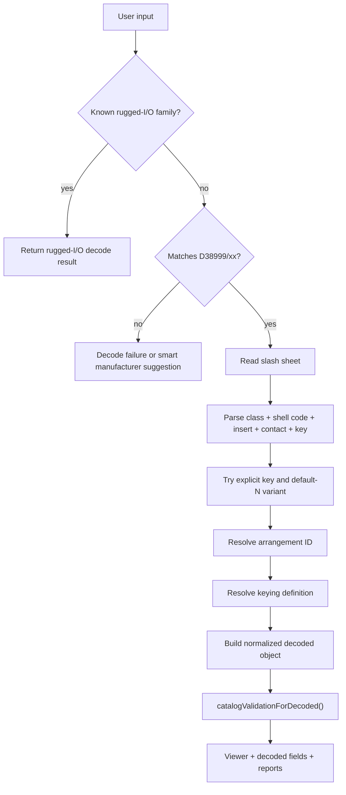
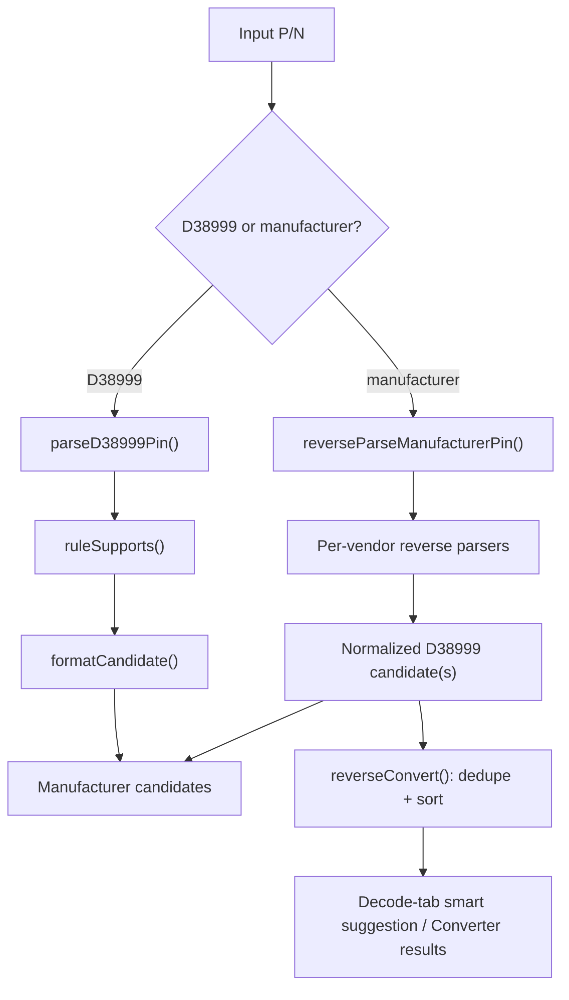
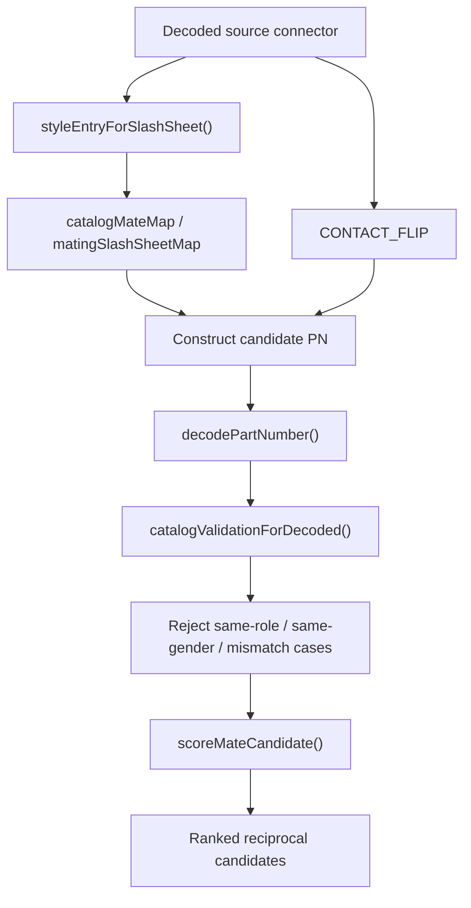

# D38999 Toolbox - Software Description

> This is the canonical technical description of how the D38999 Toolbox works: how it acquires and packages data, how the browser app loads that data, how it decodes D38999 part numbers, how it matches manufacturer part numbers, how it finds mating connectors, and how the datasets relate to each other.

## 1. Scope and system overview

The **D38999 Toolbox** is a self-contained, offline, single-page web application for
working with **MIL-DTL-38999 / D38999** circular connectors. The shipped application has
no backend and performs **no runtime `fetch()`** of JSON or APIs. It runs from static
files in `app/` and loads its runtime data from the generated `app/app-data.js`
bundle (`scripts/build_app.py`).

At runtime, the application is made of five main parts:

| Layer | Files | Responsibility |
| --- | --- | --- |
| Browser shell | `app/index.html`, `app/styles.css` | Layout, tabs, panels, theming |
| Main runtime | `app/app.js` | D38999 decode, viewer, mating, build, manual, data sources |
| Converter runtime | `app/converter.js` | D38999 <-> manufacturer conversion, rugged-I/O family recognition |
| Embedded data bundle | `app/app-data.js` | All runtime datasets and converter rules |
| Static SVG assets | `app/assets/svg/*` | Connector, insert, and rugged-I/O drawings |

The current UI exposes **9 top-level tabs** (`app/index.html`):

1. Home
2. Decode
3. Mating
4. Arrangements
5. I/O Connectors
6. P/N Converter
7. Build
8. Manual
9. Data sources

## 2. Data acquisition vs runtime loading

The app has two distinct phases that should not be confused:

1. **Build-time acquisition / extraction**: scripts under `scripts/` read source PDFs,
   scrape reference datasets where applicable, normalize the results, and write
   structured files under `data/`.
2. **Runtime loading**: `scripts/build_app.py` embeds the required subset of those
   datasets into `app/app-data.js`, and the browser reads that bundle directly with no
   network access.

That distinction matters because the app **does not fetch its data from the network when
the user opens it**. Any fetching happens only when a maintainer regenerates the local
datasets.

## 3. Source data and trust model

The repository uses a layered evidence model.

| Evidence layer | Main files | Used for | Trust |
| --- | --- | --- | --- |
| Standards / DLA source PDFs | `docs/pdfs/specs/*`, `docs/pdfs/reference/*` | Part-number grammar, insert geometry, slash-sheet definitions, keying | Highest for standard definitions |
| Manufacturer catalogs | `docs/pdfs/catalogs/*`, `docs/pdfs/datasheets/*` | Cross-reference rules, supported combinations, verified manufacturer PNs | Highest for vendor-specific mappings |
| Qualified-products data | `data/qpl/qpl_1122_*.json` | Qualified-source evidence, NSNs, validated PN corpus input | High |
| Normalized repo datasets | `data/reference/*`, `data/rules/*`, `data/part_numbers/*`, `data/connectors/*` | Runtime behavior and documentation | Depends on source provenance |
| Secondary-source index | `data/part_numbers/d38999_federalconnectors_secondary_source.json` | Supplemental existence evidence only | Lowest |

The current validation routine can return the following outcomes, in roughly this
precedence order:

1. `EXACT_PN_MATCH`
2. `VERIFIED_EXISTS`
3. `SECONDARY_SOURCE_EXACT`
4. `VALID_FORMAT_BUT_NOT_CONFIRMED`
5. `MANUFACTURER_SPECIFIC_UNCERTAIN`
6. `INVALID_COMBINATION`
7. `MISSING_DATA`

Exact status assignment is performed in `catalogValidationForDecoded()` in `app/app.js`.

## 4. Build-time acquisition and packaging flow

### 4.1 Main build-time scripts

| Stage | Scripts | Outputs |
| --- | --- | --- |
| Standards extraction | `scripts/extract_standard_definitions.py` | `data/reference/standard_definitions.json`, `data/rules/part_number_rules.json` |
| Insert extraction | `scripts/extract_arrangements.py` | `data/reference/insert_arrangements.json`, `data/rules/review_needed.json`, `assets/svg/*` |
| DLA inventory extraction | `scripts/extract_dla_documents.py` | `data/reference/dla_documents.json` |
| Corpus acquisition | `scripts/scrape_qpl_part_numbers.py`, `scripts/scrape_qpl_part_details.py`, `scripts/scrape_federalconnectors.py`, `scripts/build_valid_d38999_pns.py` | `data/qpl/*`, `data/part_numbers/*` |
| Converter database build | `scripts/build_d38999_database.py` | `data/converter/*.csv`, `data/converter/d38999_cross_reference.sqlite` |
| App packaging | `scripts/build_app.py` | `app/app-data.js`, `app/assets/svg/*` |

### 4.2 What `build_app.py` embeds

`scripts/build_app.py` assembles the runtime bundle under four top-level keys:

| Bundle key | Embedded content |
| --- | --- |
| `pinout` | `insertArrangements`, `partNumberRules`, `pinoutRules`, `standardDefinitions`, `dlaDocuments`, `reviewNeeded`, `contactCurrentRatings` |
| `converter` | `shell_size_numbers`, `series_by_shell_type`, `mil_shell_types`, `known_classes`, `contact_descriptions`, `rules` |
| `research` | `extractedRules`, `partNumberExamples`, `catalogSupportedCombinations`, `validPartNumbers`, `verifiedPartNumbers`, `federalConnectorsSecondarySource`, `visualAssets` |
| `ruggedIo` | `rugged_io_d38999_style_connectors.json` |

Two important non-embedded cases are called out directly in `scripts/build_app.py`:

- `data/environment/d38999_environment_classification/*` is **not** shipped wholesale.
  Its lightweight environment fields are already folded into the valid-part-number
  corpus.
- `data/reference/connector_engineering_reference.json` and
  `data/reference/high_speed_interface_wiring_reference.json` remain **source reference
  files**, not runtime payload.

The valid-part-number corpus is loaded with `load_dataset()` during bundling because it
may be stored on disk as a **sharded dataset directory** rather than a single JSON file.

## 5. Runtime loading and module relations

At runtime, the browser loads `app/app-data.js`, which defines:

- `window.D38999_TOOLBOX_DATA`
- `window.D38999_DATA` (legacy alias to the `pinout` portion)

`app/app.js` consumes the `pinout` and `research` sections and also reads the
`converter` section for builder and reporting flows. `app/converter.js` consumes the
`converter` section and publishes `globalThis.D38999Converter`, which `app/app.js` then
uses for smart manufacturer-PN suggestions and cross-reference reporting.

## 6. D38999 part-number decoding

The main decoder lives in `decodePartNumber()` in `app/app.js`.

### 6.1 Inputs used by the decoder

| Dataset / source | Role in decoding |
| --- | --- |
| `data/rules/part_number_rules.json` | Canonical field structure and patterns |
| `data/reference/standard_definitions.json` | Slash sheets, classes, shell-size codes, contact styles, keying definitions |
| `data/reference/insert_arrangements.json` | Arrangement existence, geometry, contact map |
| `data/reference/dla_documents.json` | Supplemental slash-sheet metadata |
| `data/part_numbers/d38999_catalog_supported_combinations.json` | Rule-backed support checks |
| `data/part_numbers/d38999_valid_part_numbers/*` | Exact-match validation and environment metadata |
| `data/part_numbers/d38999_verified_part_numbers.json` | Catalog-verified exact matches |
| `data/part_numbers/d38999_federalconnectors_secondary_source.json` | Secondary-source exact matches |

### 6.2 Decode algorithm

1. If the input matches a known rugged-I/O family, return a rugged-I/O decode result
   first via `D38999Converter.recognizeRuggedIo()`.
2. Otherwise require a `D38999/xx` prefix and extract the slash sheet.
3. Parse the body using the **longest class candidate first**, so overlapping class
   codes such as `A`, `AA`, and `AB` resolve correctly.
4. Split the remaining body into:
   - class / finish
   - shell-size code
   - insert arrangement
   - contact style
   - polarization
5. Try two variants:
   - explicit polarization present
   - polarization omitted, defaulting to `N`
6. Score the candidate parse by:
   - arrangement existence
   - explicit vs defaulted polarization
   - whether a keying definition exists
7. Resolve the final arrangement ID as `shell size + arrangement number` (for example
   `17-35`).
8. Return a normalized decoded object, appending `N` when keying was omitted.
9. Pass the decoded result into catalog-backed validation and viewer rendering.

### 6.3 Decode flow

## 7. Manufacturer part-number matching

Manufacturer matching is split into **forward conversion** and **reverse matching**.

### 7.1 Forward conversion: D38999 -> manufacturer P/N

Forward conversion is implemented in `app/converter.js`:

1. `parseD38999Pin()` parses the D38999 input into normalized fields.
2. `ruleSupports(rule, parsed)` filters manufacturer rules by:
   - series
   - shell type
   - shell-size code
   - contact style
   - keying
   - supported finish/class
3. `formatCandidate(rule, parsed)` formats the manufacturer-specific P/N string.
4. `convertParsed(parsed)` returns candidate rows per manufacturer and product line.

The rule source of truth is `scripts/d38999_rules.py`, embedded into the runtime bundle
under `window.D38999_TOOLBOX_DATA.converter.rules`.

### 7.2 Reverse matching: manufacturer P/N -> D38999

Reverse matching also lives in `app/converter.js` and uses per-vendor parsers:

- `reverseParseAmphenol()`
- `reverseParseConesys()`
- `reverseParseEaton()`
- `reverseParseGlenair()`
- `reverseParseItt()`
- `reverseParseSouriau()`
- `reverseParseTeDts()`
- `reverseParseTeAct()`

These functions normalize manufacturer-specific prefixes, finish codes, shell-size
formats, and suffix rules back into a D38999-style decoded object via `makeParsed()`.

`reverseConvert()` then:

1. deduplicates candidates,
2. assigns vendor/source metadata,
3. generates forward cross-reference rows for each normalized D38999 candidate,
4. sorts results for presentation.

### 7.3 Smart manufacturer suggestion in the Decode tab

If `decodePartNumber()` fails but the input looks like a manufacturer P/N,
`decodeFromInput()` in `app/app.js` calls `reverseConvertSafe(raw)` and renders a
one-click suggestion banner through `renderSmartSuggestion()`. That lets the user enter
`TV06RW-15-35PN` and jump directly into the normal D38999 decode flow.

### 7.4 Manufacturer matching flow

## 8. Mating logic

The mating engine lives primarily in `mateCandidatesForDecoded()` in `app/app.js`.

It is deliberately **catalog-backed**, not pure string mutation.

### 8.1 Inputs used by the mating engine

| Dataset / source | Role |
| --- | --- |
| `data/rules/d38999_extracted_rules.json` | Normalized shell styles, mating slash-sheet map, shell-role metadata |
| `data/part_numbers/d38999_catalog_supported_combinations.json` | Allowed shell-style/contact/keying combinations |
| `data/part_numbers/d38999_valid_part_numbers/*` | Exact-match and environment-backed validation |
| `data/part_numbers/d38999_verified_part_numbers.json` | Catalog-verified exact target PNs |
| `data/part_numbers/d38999_federalconnectors_secondary_source.json` | Lower-trust existence evidence |

### 8.2 Mating algorithm

1. Start from a successfully decoded D38999 connector.
2. Look up its normalized shell-style record with `styleEntryForSlashSheet()`.
3. Read allowed mate slash sheets from `catalogMateMap`, which is built from
   `extractedRules.matingSlashSheetMap`.
4. Flip the contact style using `CONTACT_FLIP` (`P` -> `S`, `S` -> `P`, etc.).
5. Construct a candidate part number for each mate slash sheet while keeping:
   - shell size
   - insert arrangement
   - polarization
6. Decode each candidate again with `decodePartNumber()`.
7. Validate the candidate with `catalogValidationForDecoded()`.
8. Reject the candidate if any hard rule fails:
   - same connector as source
   - shell-size mismatch
   - insert-arrangement mismatch
   - keying mismatch
   - same contact gender
   - same mating role
   - accessory / non-mating shell style
9. Score remaining candidates with `scoreMateCandidate()`.
10. Render ranked options in the Mating tab.

### 8.3 Mating flow

### 8.4 Validation states used by mating and build flows

| Status | Meaning in the app |
| --- | --- |
| `EXACT_PN_MATCH` | Exact PN found in the valid D38999 corpus |
| `VERIFIED_EXISTS` | Exact PN found in the verified catalog research set |
| `SECONDARY_SOURCE_EXACT` | Exact PN found only in the lower-trust secondary-source set |
| `VALID_FORMAT_BUT_NOT_CONFIRMED` | Combination fits cited rules, but no exact local PN hit |
| `MANUFACTURER_SPECIFIC_UNCERTAIN` | Local rules indicate a vendor-specific or hermetic caveat |
| `INVALID_COMBINATION` | Required fields conflict with local rules |
| `MISSING_DATA` | Local evidence is not sufficient to validate the candidate |

## 9. Data relations

The most important data relationships are shown below.

```mermaid
flowchart TB
    PartRules["data/rules/part_number_rules.json"] --> Decoder["decodePartNumber()"]
    StdDefs["data/reference/standard_definitions.json"] --> Decoder
    Arr["data/reference/insert_arrangements.json"] --> Decoder
    DlaDocs["data/reference/dla_documents.json"] --> Decoder

    RulesPy["scripts/d38999_rules.py"] --> ConvBundle["converter rules in app-data.js"]
    RulesPy --> ConvTables["data/converter/*.csv + .sqlite"]
    ConvBundle --> Conv["app/converter.js"]

    Extracted["data/rules/d38999_extracted_rules.json"] --> Mating["mateCandidatesForDecoded()"]
    Supported["data/part_numbers/d38999_catalog_supported_combinations.json"] --> Validator["catalogValidationForDecoded()"]
    Valid["data/part_numbers/d38999_valid_part_numbers/*"] --> Validator
    Verified["data/part_numbers/d38999_verified_part_numbers.json"] --> Validator
    Secondary["data/part_numbers/d38999_federalconnectors_secondary_source.json"] --> Validator

    Decoder --> Viewer["Decode tab / viewer"]
    Validator --> Viewer
    Validator --> Mating
    Mating --> MatingUI["Mating tab"]
    Conv --> ConverterUI["Converter tab"]
    Decoder --> BuildUI["Build tab"]
    StdDefs --> ManualUI["Manual tab"]
    DlaDocs --> DataSourcesUI["Data sources tab"]
```

### 9.1 Dataset ownership matrix

| Dataset | Produced from | Embedded at runtime | Main consumers |
| --- | --- | --- | --- |
| `data/reference/insert_arrangements.json` | `scripts/extract_arrangements.py` + arrangement PDF | Yes | Decode, viewer, catalog, build |
| `data/reference/standard_definitions.json` | `scripts/extract_standard_definitions.py` + MIL-DTL-38999 PDF | Yes | Decode, manual, build |
| `data/rules/part_number_rules.json` | `scripts/extract_standard_definitions.py` | Yes | Decode, build |
| `data/reference/dla_documents.json` | `scripts/extract_dla_documents.py` | Yes | Manual, data sources |
| `data/rules/review_needed.json` | `scripts/extract_arrangements.py` QA output | Yes | Warnings / review hints |
| `scripts/d38999_rules.py` | Maintained rule source | Yes, via bundle | Converter, smart reverse matching |
| `data/rules/d38999_extracted_rules.json` | Research normalization | Yes | Mating, shell-style context |
| `data/part_numbers/d38999_catalog_supported_combinations.json` | Research corpus | Yes | Validation, mating |
| `data/part_numbers/d38999_valid_part_numbers/*` | Built valid-PN corpus | Yes | Exact matches, environment filters |
| `data/part_numbers/d38999_verified_part_numbers.json` | Catalog verification extraction | Yes | Exact verified status |
| `data/part_numbers/d38999_federalconnectors_secondary_source.json` | Secondary-source scrape | Yes | Supplemental existence evidence |
| `data/connectors/d38999_visual_assets.json` | Visual-asset registry | Yes | Rugged-I/O / provenance views |
| `data/connectors/rugged_io_d38999_style_connectors.json` | Rugged-I/O catalog extraction | Yes | I/O tab and rugged family recognition |
| `data/reference/contact_current_ratings.json` | Catalog electrical extraction | Yes | Contact current guidance |
| `data/reference/connector_engineering_reference.json` | Reference compilation | No | Source reference only |
| `data/reference/high_speed_interface_wiring_reference.json` | Reference compilation | No | Source reference only |
| `data/environment/d38999_environment_classification/*` | Environment audit build | Not wholesale | Folded into valid-PN corpus |

## 10. What the software does not do

The current design intentionally does **not** do the following:

- It does not call live manufacturer APIs or DLA services at runtime.
- It does not claim that every syntactically valid PN is catalog-verified.
- It does not treat a secondary-source hit as equal to a catalog-verified PN.
- It does not manufacture a mate for unsupported shell styles solely by string
  mutation.
- It does not embed every research file into the browser; only the subset needed by
  the runtime is shipped.

## 11. Summary

The D38999 Toolbox is best understood as a **static browser application backed by a
build-time generated local knowledge base**:

1. source PDFs and external reference datasets are ingested into `data/`,
2. `scripts/build_app.py` embeds the runtime subset into `app/app-data.js`,
3. `app/app.js` and `app/converter.js` perform decode, conversion, mating, and
   provenance display entirely in the browser,
4. validation and mating decisions are grounded in the local catalog-backed datasets
   instead of uncontrolled string heuristics.
